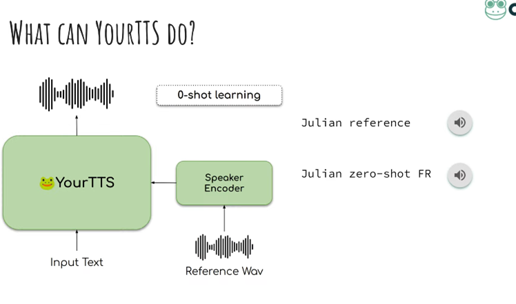
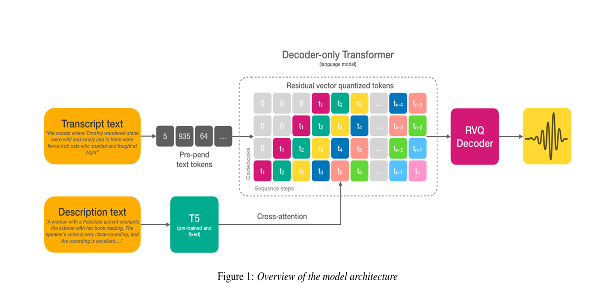

# Natural Language Guidance of High-Fidelity Text-to-Speech (TTS) with Synthetic Annotations

This repository showcases the implementation of a novel text-to-speech (TTS) system using **natural language prompts** to intuitively guide voice generation. By describing voice characteristics like *"a calm male voice with a British accent,"* this system eliminates the dependency on reference recordings, offering scalability and flexibility in high-fidelity speech synthesis.

---

## Objective

The project aims to:
- Enable TTS systems to generate diverse and novel speech outputs guided by natural language descriptions.
- Provide users with intuitive control over speaker style, tone, and accent through descriptive text prompts.
- Overcome the limitations of traditional reference-based conditioning in TTS systems.

---

## Problem Statement

Traditional TTS methods rely heavily on reference recordings, which:
- Limit scalability for diverse datasets and use cases.
- Lack flexibility in creating entirely new or unique speech outputs.
- Require a large corpus of recordings for every possible voice or style variation.

---

## Dataset

- **Dataset Name**: [Jenny-TTS-Tags-6h](https://huggingface.co/datasets/Cintin/jenny-tts-tags-6h)
  - Hosted on Hugging Face.
  - Contains synthetic annotations to train TTS systems with natural language prompts.
  - Enables training and evaluation of diverse speaker styles.

---

## Architecture and Block Diagram

The system's design and workflow are represented below:

### **Block Diagram**

### **Architecture**

---

## Features

1. **Natural Language Prompting**:
   - Users can control speaker style and tone with descriptive text inputs.
   - Example: *"a cheerful female voice with an American accent."*
2. **Zero-Shot Voice Synthesis**:
   - Generates voices not seen during training.
3. **Scalability**:
   - Removes dependency on reference recordings, making the system suitable for diverse and novel speech synthesis.

---

## Models Used

1. **YourTTS**:
   - A state-of-the-art zero-shot multi-speaker TTS model.
   - Supports voice synthesis and voice conversion.
   - Paper: *YourTTS: Towards Zero-Shot Multi-Speaker TTS and Zero-Shot Voice Conversion for Everyone*.
2. **Natural Language Prompting Layer**:
   - Maps descriptive prompts to speaker embeddings for enhanced control over synthesis.

---

## Results

### **Key Achievements**
- High-quality, diverse speech synthesis guided by natural language prompts.
- Successful evaluation using synthetic annotations from the Jenny-TTS-Tags-6h dataset.

### **Examples**
- **Input Prompt**: *"a deep male voice with a commanding tone."*
  - Output: Speech matching the description.
- **Input Prompt**: *"a cheerful female voice with an Australian accent."*
  - Output: Speech synthesized as described.

